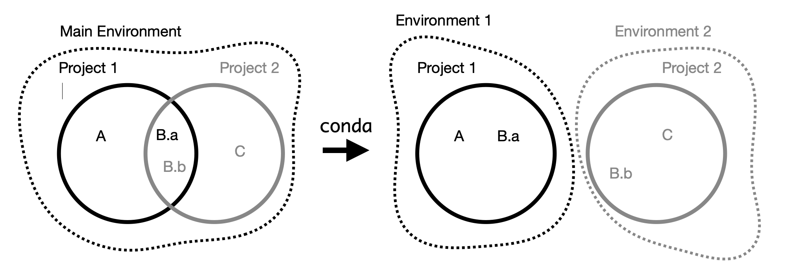

  

    Table of contents
  

  {: .text-delta }
1. TOC
{:toc}

# What is `conda`?

At the very core `conda` is a programming-language-agnostic package manager. In
the following, I will try to explain what packages are, why do we use them, and
why do we need someone or something to manage them.

## What is a package? 

A package is anything you install using your package manager. In particular, a
`conda` package is a compressed tarball that contains two things
1. a module that you can be installed
2. a recipe on 'how to install the module'

## Why do we need something to manage packages?

### Simple dependencies

Not all packages were developed to work on all machines or all version of other
software. A good example are syntax changes in `python`. With new python
versions (not only `2->3`). Going from `3.9->3.10` there have been changes on
the `typing` syntax. If you update your code to the new way of defining input
types. Older versions of `python` will not be able to run your code anymore.
Furthermore, you may have a dependency that cannot be run on a newer `python`
version. In such cases, it makes sense to find the versions of the packages that
overlap in their dependency structure and work with each other. A package
manager such as `conda` will take care of that for you at installation time
(sometimes this takes a ridiculous amount of time if you have a number of
packages installed).

### Project specific dependencies 

Furthermore, you may have two or more projects, that require different
dependencies of the same software. Say, we are working on `Project 1` and
`Project 2`. `Project 1` has the dependencies `Software A` and `Software B`, and
`Project 2` depends on `Software B` and `Software C`. Now, `Software A` depends
on a specific version of `Software B` but `Software C` depends on a different
version of `Software B`. That's not exactly ideal. Installing either version of
`Software B` will break the other `Project`. `conda` lets us easily create and
manage separate environments to avoid such version conflicts, and automatically
checks the installed version against when we try to install something new. That
way, nothing breaks and we can have both versions.

_Figure showing the interproject dependencies and how `conda` takes care of it.
On the left-hand side we have a single umbrella environment that contains all
package dependencies. On the right-hand side, using an environment manager (e.g.
conda), we divide the projects into two different environments. Now, the package
`B` does suffer from a version conflict anymore_

### Reproducible research

The third motivation here is creating environments, such that your research can
be reproduced in the future. `conda` keeps track of the versions of the programs
that you are installing. This information can be extracted and exported to a
file. We can recreate the environment that your research was computed in using
the exported file, which often named `environment.yml` or `env.yml`. This
protects you against possible changes in future versions of, e.g. `numpy` or
`scipy`. For example, at some point `numpy` updated how you access the `fft`
modules, breaking many signal processing applications. With an version tracked
`environment.yml` this would not happen.

